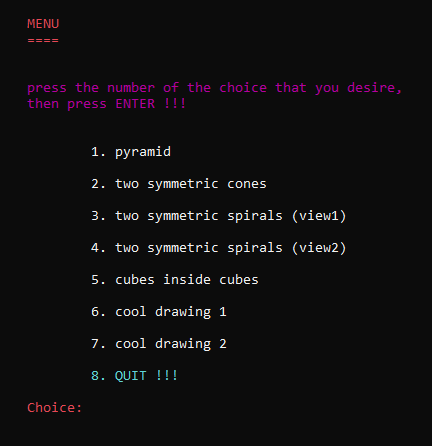
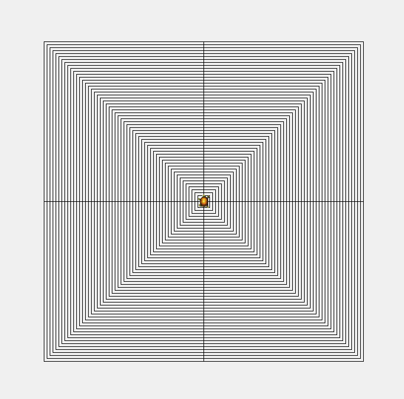
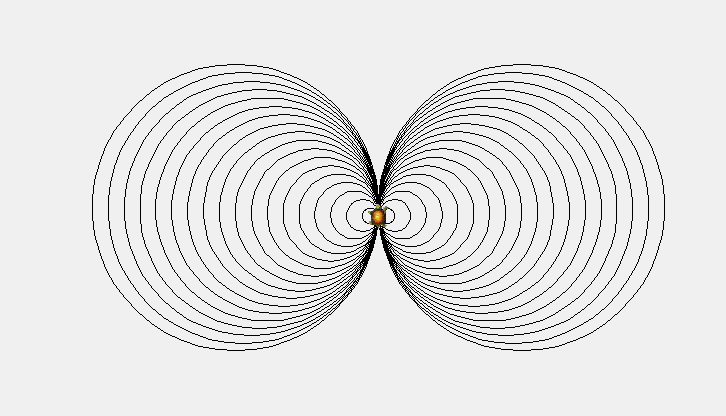
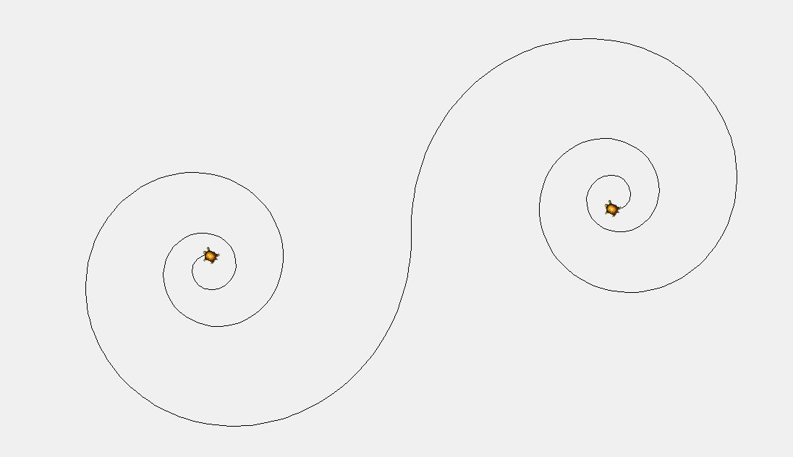
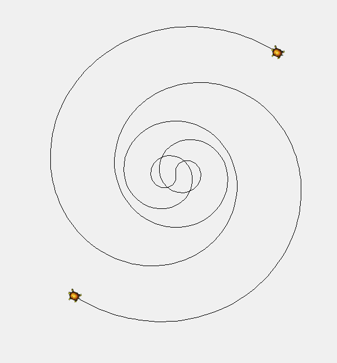
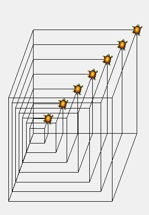
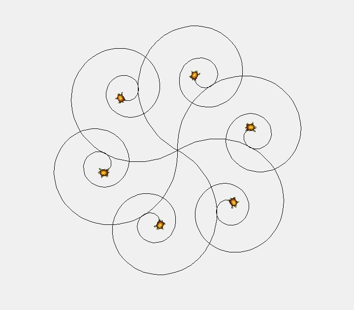

# Turtle Fun 🐢🐢🐢

<h3> " a blast from the past " 🐢🐢</h3> 

<i><b> as far as I can remember, it was programmed around Christmas 2007 , New Year 2008 </i></b>   🐢

It was last year at high-school; the C.S. teacher introduced us to a C# (.dll) called Unit4.dll , which adds a [Turtle Graphics](https://en.wikipedia.org/wiki/Turtle_graphics) function similar to what is in the old and well-known [LOGO](https://en.wikipedia.org/wiki/Logo_(programming_language)) .  I liked it, because even earlier at elementary school I had memories of playing with an older DOS version of LOGO at some computer lab.  So, made few more "complex" drawings using it , using some loops & maths that I got more experienced at during high-school.

+ [Releases](TurtleFun/bin/Release) (.exe) are included inside the uploaded code
+ Unit4.dll should be at the same folder as the TurtleFun.exe is.
+ It was built for an older version of Windows (probably winXP), but tested it on Win10, and it worked just fine.

Some Screenshots :-

&emsp;&emsp;&emsp;&emsp;&emsp;&emsp;&emsp;

